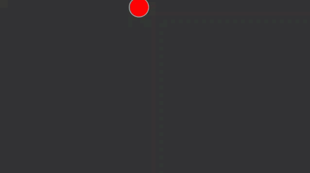

[Introduction](.../) [Vectors](../)

# Vector Motion Velocity

```js
var mover;

function setup() {
  createCanvas(640,360);
  mover = new Mover();  
}

function draw() {
  background(51);

  mover.update();
  mover.checkEdges();
  mover.display();
}

```


The mover class
```js
var Mover = function () {

    this.location = createVector(random(width), random(height));
    this.velocity = createVector(10, 5);

    this.update = function () {
        this.location.add(this.velocity);
    }

    this.display = function () {
        //pick a brush
        stroke(150);
        strokeWeight(2);
        fill(255, 0, 0);

        //And draw an ellipse at the new location vector points
        ellipse(this.location.x, this.location.y, 40, 40);
    }

    this.checkEdges = function () {
        if (this.location.x > width || this.location.x < 0) {
            this.velocity.x = this.velocity.x * -1;
        }
        if (this.location.y > height || this.location.y <0) {
            this.velocity.y = this.velocity.y * -1;
        }
    }
}

```

