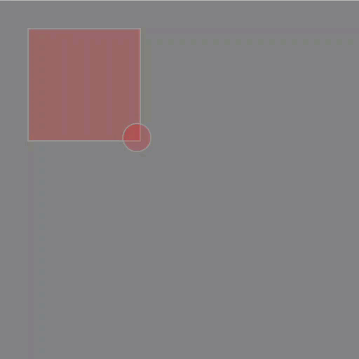

Liquid Experiment](./)

Take at look at mover.js and Liquid.js
1. [mover](mover/)
2. [liquid](liquid/)

# Liquid Experiment - part 4


```js
var ball;
var liquid;

function setup() {
  createCanvas(640, 640);
  //_x, _y, _vx, _vy, _ax, _ay, mass
  ball = new Mover(200, 200, 2, 2, 0, 0, 5);

  //(x, y, w, h, c)
  liquid = new Liquid(50, 50, 200, 200, 50);
}
```

```js
function draw() {
  background(127);

    liquid.display();

    ball.update();
    ball.display();
    ball.checkEdges();

    if (liquid.contains(ball)){
    console.log("is in liquid");
    }
}
```

